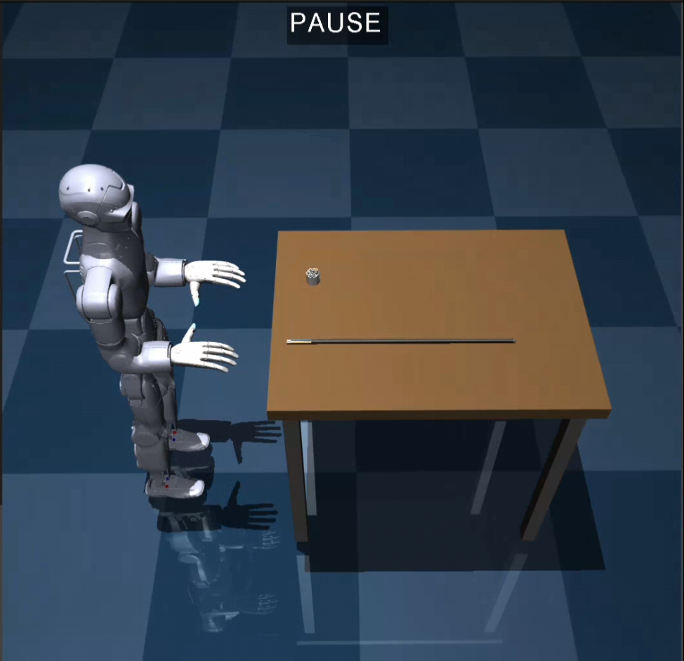
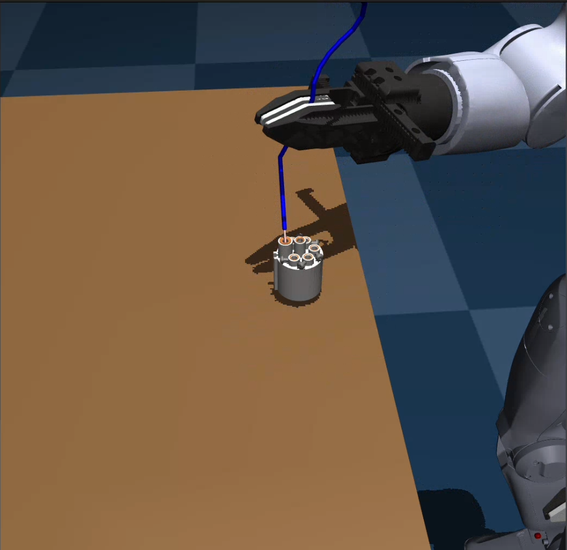
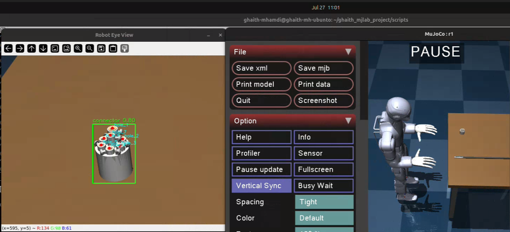
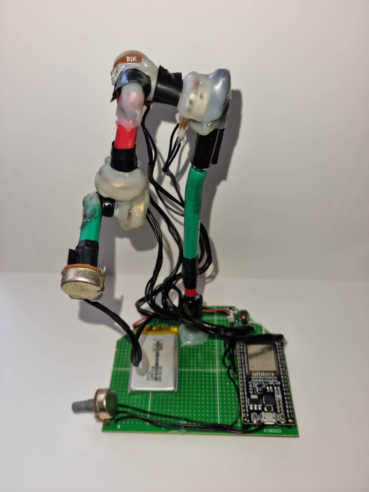
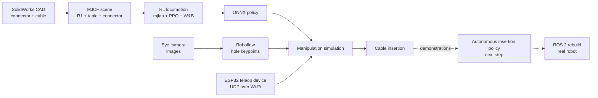

<div align="center">

<!-- TODO: optional wide banner: media/banner.png (or reuse r1_simulation.png) -->


# Unitree R1 — Wire Insertion with mjlab

**Teaching a humanoid to walk, see and insert cables into a connector — from CAD to simulation, RL, vision and teleoperation.**


</div>

---

## Overview

This project builds a complete simulation pipeline for a **Unitree R1 humanoid** that must perform a precise manufacturing task: **insert 7 colour-coded cables, each into its assigned hole in a connector**, a job that is done by hand today in wire-harness production.

It is built on **[mjlab](https://github.com/mujocolab/mjlab)** (MuJoCo-based, GPU-parallel RL) and covers the whole chain:

1.  **CAD → simulation**: SolidWorks model of the connector and cables, converted to MJCF
2.  **RL locomotion**: walking and standing policy trained with PPO, exported to ONNX
3.  **Vision**: connector-hole keypoint detection from the robot's eye camera
4.  **Teleoperation**: a custom ESP32 arm-shaped device drives the robot's right arm over Wi-Fi
5.  **Insertion**: cable inserted in simulation using teleoperation
6.  **Next**: autonomous insertion policy trained with RL, seeded by teleop demonstrations

> Developed during an engineering internship at **Farness** (end application: Agilink cable/wire-harness production). <!-- TODO: remove this line if you prefer not to name the company -->

---

##  Demos

> Click a preview to open the full video.

### Full project demo
<!-- media/project_demo.gif + media/project_demo.mp4 -->
[](media/project_demo.mp4)

### Cable insertion in simulation
[](media/cable_insertion.mp4)

### Locomotion training
[](media/locomotion_training.mp4)

---

##  Gallery

<table>
  <tr>
    <td align="center"><br/><sub>Cable insertion scene</sub></td>
    <td align="center"><br/><sub>Connector hole keypoint detection</sub></td>
  </tr>
  <tr>
    <td align="center"><br/><sub>ESP32 teleoperation device</sub></td>
    <td align="center"><br/><sub>R1 at the table in mjlab</sub></td>
  </tr>
</table>

---

##  Features

-  **Unitree R1** (MJCF from `unitree_rl_mjlab`) with interchangeable hands: Dex1, Dex3-1 and BrainCo Revo2
-  **Custom wire-insertion scene**: 7-colour cable, connector and table, modelled from SolidWorks CAD
-  **Velocity-tracking locomotion** (walking + zero-command standing) trained with PPO in thousands of parallel environments
-  **ONNX policy export** and deployment inside the manipulation simulation
-  **Roboflow keypoint model** (RF-DETR) detecting connector holes from simulated eye-camera images
-  **Wi-Fi teleoperation** with ESP32 + potentiometers streaming joint states over UDP
-  **Arm IK** helper (`arm_ik.py`) for end-effector control
-  **Experiment tracking** with Weights & Biases
-  **Clean task registration** via Python entry points: editable install, no changes to `site-packages`

---

##  Pipeline



---

##  Repository Structure

```
ghaith_mjlab_project/
├── media/                         # Demo videos, GIFs and images
├── notebooks/                     # Early notes / experiments
├── scripts/
│   ├── download_model.py
│   ├── sim_merged_locally_esp32_commands.py
│   ├── sim_robot_fixed_esp_controls_right_arm.py
│   └── sim_with_connector_detection.py
├── src/
│   ├── ghaith_cartpole/           # Minimal external-task template
│   └── ghaith_r1_wire/
│       ├── assets/                # MJCF + meshes: R1, cable, connector, hands, table
│       ├── esp32_commander/       # ESP32 firmware (5-pot joints over UDP)
│       ├── model/                 # Trained policy (ONNX) + params
│       ├── arm_ik.py
│       ├── env_cfg.py             # Environment / task configuration
│       ├── rl_cfg.py              # PPO configuration
│       ├── mdp_events.py          # Custom events
│       └── read_joints_esp32_wifi.py
└── pyproject.toml
```

---

##  Getting Started

### 1. Create the environment

```bash
# Install Miniconda: https://docs.conda.io/en/latest/miniconda.html
conda create -n mjlab python=3.11 -y
conda activate mjlab
pip install mjlab wandb
```

Check the installation:

```bash
python -m mjlab.scripts.list_envs
```

### 2. Install this project (editable)

```bash
git clone https://github.com/ghaithmhamd/<repo-name>.git
cd <repo-name>
pip install -e .
```

The editable install registers the task through entry points, so `Ghaith-Velocity-Flat-Unitree-R1-Wire` shows up in `list_envs` without touching `site-packages`.

### 3. Log in to Weights & Biases

```bash
wandb login
```

---

##  Usage

### Check the task (no training)

```bash
python -m mjlab.scripts.play Ghaith-Velocity-Flat-Unitree-R1-Wire \
  --viewer viser \
  --agent zero
```

Use `--viewer native` for the local MuJoCo window.

### Train

```bash
python -m mjlab.scripts.train Ghaith-Velocity-Flat-Unitree-R1-Wire \
  --env.scene.num-envs 1000
```

### Resume training

```bash
python -m mjlab.scripts.train Ghaith-Velocity-Flat-Unitree-R1-Wire \
  --agent.resume True \
  --wandb-run-path <entity>/<project>/<run-id>
```

### Play a trained policy

```bash
# From a W&B run
python -m mjlab.scripts.play Ghaith-Velocity-Flat-Unitree-R1-Wire \
  --viewer viser \
  --wandb-run-path <entity>/<project>/<run-id>

# From a local checkpoint
python -m mjlab.scripts.play Ghaith-Velocity-Flat-Unitree-R1-Wire \
  --viewer viser \
  --checkpoint-file path/to/model.pt
```

### Inspect the robot model

```bash
python -m mujoco.viewer --mjcf src/ghaith_r1_wire/assets/unitree_r1/xmls/r1.xml
```

### Run the manipulation simulation

<!-- TODO: confirm what each script does and adjust the descriptions -->
```bash
# Teleoperation: ESP32 device drives the right arm
python scripts/sim_robot_fixed_esp_controls_right_arm.py

# Teleoperation + locomotion policy
python scripts/sim_merged_locally_esp32_commands.py

# With connector hole detection (needs a Roboflow API key, see below)
python scripts/sim_with_connector_detection.py
```

---

##  Teleoperation Device

<p align="center"></p>

An arm-shaped device with **potentiometers as joints** between rigid links, driven by an **ESP32** and a battery. It streams the joint angles over **UDP via Wi-Fi**; `read_joints_esp32_wifi.py` receives them inside the simulation so moving the device moves the R1's simulated right arm.

Firmware: `src/ghaith_r1_wire/esp32_commander/esp32_5pot_joints_udp/`

---

##  Vision

About 300 images were captured from the robot's simulated eye camera and annotated in **Roboflow** as a keypoint (skeleton) model that detects the connector holes. The model is then integrated back into the simulation.

<p align="center"></p>

Set your key as an environment variable (never hard-code it):

```bash
export ROBOFLOW_API_KEY="your_key_here"
```

---

##  Roadmap

- [x] CAD of connector and cable, MJCF scene with R1 at a table
- [x] RL walking + standing policy with W&B tracking
- [x] ONNX export and deployment in the manipulation sim
- [x] Connector hole keypoint detection
- [x] Wi-Fi teleoperation device
- [x] Cable insertion in simulation via teleoperation
- [ ] Autonomous wire-insertion policy with RL, seeded by teleop demonstrations
- [ ] Teacher-student distillation for sim-to-real
- [ ] Rebuild the simulation in ROS 2 for the real robot

<!-- TODO: adjust to your real status -->

---

##  Acknowledgements

- [mjlab](https://github.com/mujocolab/mjlab) and [MuJoCo](https://mujoco.org/)
- [Unitree](https://www.unitree.com/): R1 model from `unitree_rl_mjlab`, Dex1 and Dex3-1 hands
- [BrainCo](https://www.brainco.cn/): Revo2 hand model
- [Roboflow](https://roboflow.com/) and [Weights & Biases](https://wandb.ai/)

Third-party robot assets keep their original licenses.

---

##  Author

**Ghaith Mhamdi** — Engineering student, École Polytechnique de Tunisie
Robotics · Embedded Systems · FPGA · Autonomous Systems

[](https://www.linkedin.com/in/<your-handle>)
[](https://github.com/ghaithmhamd)

---

## 📄 License

Project code is released under the MIT License. See `LICENSE`. Unitree and BrainCo assets remain under their own licenses.
